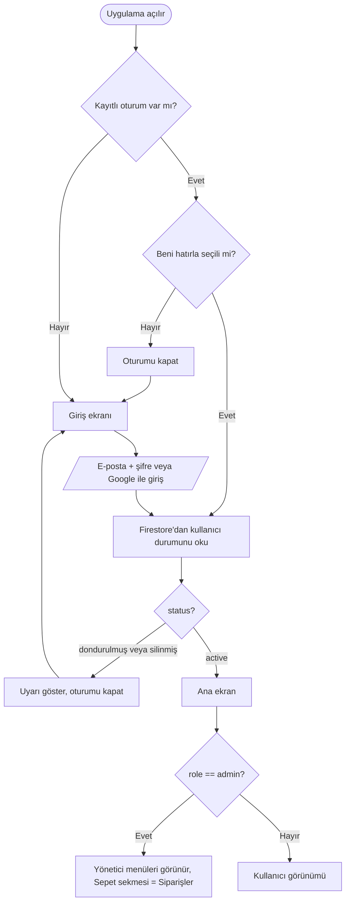
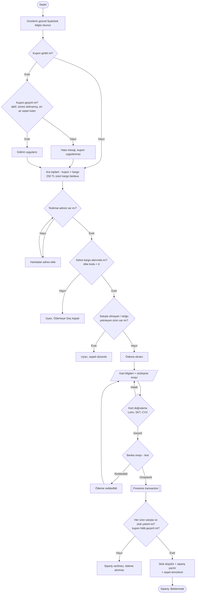
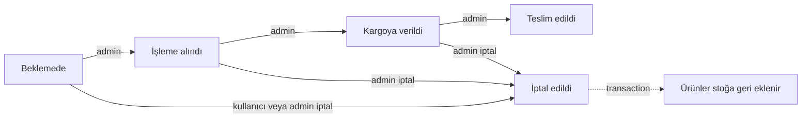
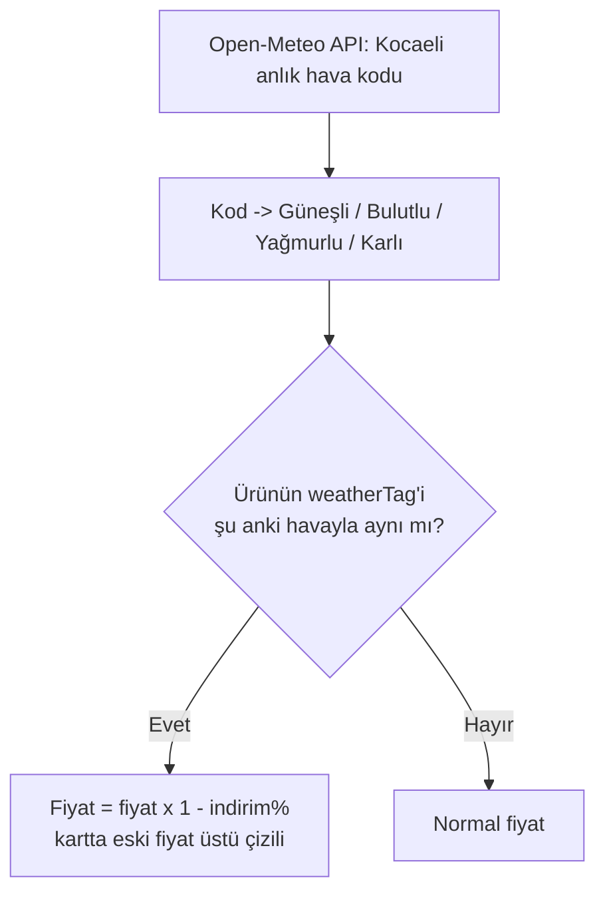
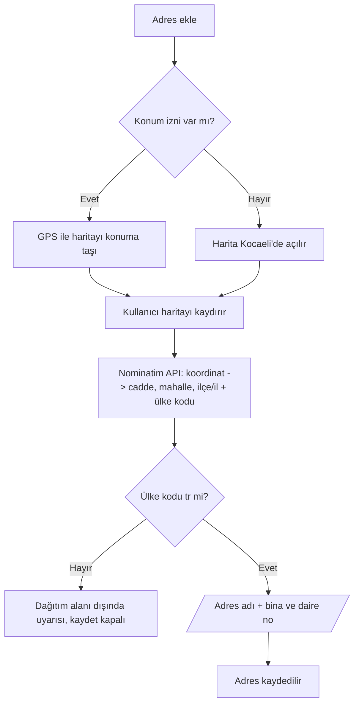

# Shingu Akış Diyagramları

## 1. Uygulama açılışı ve giriş

```mermaid
flowchart TD
    A([Uygulama açılır]) --> B{Kayıtlı oturum var mı?}
    B -- Evet --> C{Beni hatırla seçili mi?}
    C -- Hayır --> D[Oturumu kapat] --> E[Giriş ekranı]
    C -- Evet --> F[Firestore'dan kullanıcı durumunu oku]
    B -- Hayır --> E
    E --> G[/E-posta + şifre veya Google ile giriş/]
    G --> F
    F --> H{status?}
    H -- dondurulmuş veya silinmiş --> I[Uyarı göster, oturumu kapat] --> E
    H -- active --> J[Ana ekran]
    J --> K{role == admin?}
    K -- Evet --> L[Yönetici menüleri görünür, Sepet sekmesi = Siparişler]
    K -- Hayır --> M[Kullanıcı görünümü]
```

## 2. Sepetten sipariş verme (ödeme)

```mermaid
flowchart TD
    A([Sepet]) --> B[Ürünlerin güncel fiyat/stok bilgisi okunur]
    B --> C{Kupon girildi mi?}
    C -- Evet --> D{Kupon geçerli mi?<br/>aktif, süresi dolmamış, en az sepet tutarı}
    D -- Hayır --> E[Hata mesajı, kupon uygulanmaz]
    D -- Evet --> F[İndirim uygulanır]
    C -- Hayır --> G
    E --> G
    F --> G[Ara toplam - kupon + kargo<br/>250 TL üzeri kargo bedava]
    G --> H{Teslimat adresi var mı?}
    H -- Hayır --> I[Haritadan adres ekle] --> H
    H -- Evet --> J{Adres kargo alanında mı?<br/>ülke kodu = tr}
    J -- Hayır --> K[Uyarı, Ödemeye Geç kapalı]
    J -- Evet --> L{Satışta olmayan / stoğu<br/>yetmeyen ürün var mı?}
    L -- Evet --> M[Uyarı, sepeti düzenle]
    L -- Hayır --> N[Ödeme ekranı]
    N --> O[/Kart bilgileri + sözleşme onayı/]
    O --> P{Kart doğrulama<br/>Luhn, SKT, CVV}
    P -- Hatalı --> O
    P -- Geçerli --> Q{Banka onayı - test}
    Q -- Reddedildi --> R[Ödeme reddedildi] --> O
    Q -- Onaylandı --> S[[Firestore transaction]]
    S --> T{Her ürün satışta ve<br/>stok yeterli mi?<br/>kupon hâlâ geçerli mi?}
    T -- Hayır --> U[Sipariş verilmez, ödeme alınmaz]
    T -- Evet --> V[Stok düşülür + sipariş yazılır<br/>+ sepet temizlenir]
    V --> W([Sipariş: Beklemede])
```

## 3. Sipariş durumu ve iptal

```mermaid
flowchart LR
    P[Beklemede] -->|admin| PR[İşleme alındı]
    PR -->|admin| S[Kargoya verildi]
    S -->|admin| D[Teslim edildi]
    P -->|kullanıcı veya admin iptal| C[İptal edildi]
    PR -->|admin iptal| C
    S -->|admin iptal| C
    C -.->|transaction| R[Ürünler stoğa geri eklenir]
```

## 4. Hava durumuna göre indirim

```mermaid
flowchart TD
    A[Open-Meteo API: Kocaeli anlık hava kodu] --> B[Kod -> Güneşli / Bulutlu / Yağmurlu / Karlı]
    B --> C{Ürünün weatherTag'i<br/>şu anki havayla aynı mı?}
    C -- Evet --> D[Fiyat = fiyat x 1 - indirim%<br/>kartta eski fiyat üstü çizili]
    C -- Hayır --> E2[Normal fiyat]
```

## 5. Haritadan adres seçme

```mermaid
flowchart TD
    A[Adres ekle] --> B{Konum izni var mı?}
    B -- Evet --> C[GPS ile haritayı konuma taşı]
    B -- Hayır --> D[Harita Kocaeli'de açılır]
    C --> E
    D --> E[Kullanıcı haritayı kaydırır]
    E --> F[Nominatim API: koordinat -> cadde, mahalle, ilçe/il + ülke kodu]
    F --> G{Ülke kodu tr mi?}
    G -- Hayır --> H[Dağıtım alanı dışında uyarısı, kaydet kapalı]
    G -- Evet --> I[/Adres adı + bina ve daire no/] --> J[Adres kaydedilir]
```
